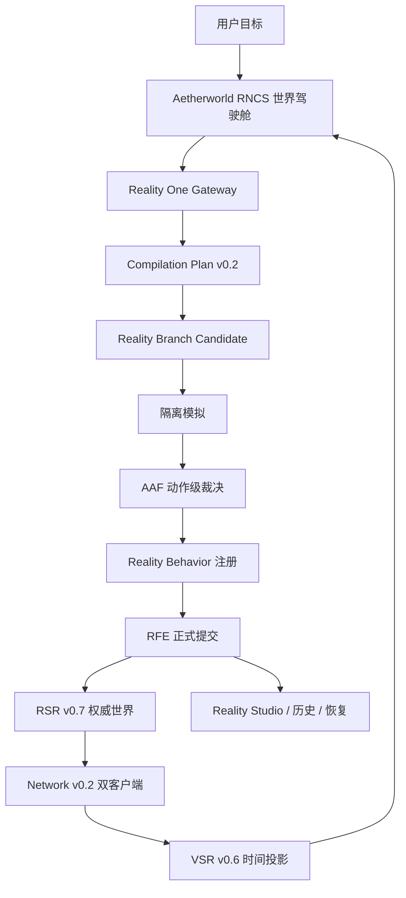

# Aetherworld RNCS Native Runtime Architecture v0.7

## 目标结构

## 权威边界

- **事实权威：** RFE Generation。
- **物理权威：** 当前 RFE 世界状态物化出的 RSR 权威帧。
- **多人权威：** Network 服务端持有的 RSR 权威状态。
- **表现权威：** 无；VSR 仅拥有 Presentation Root。
- **用户界面：** 观察、发起候选和提交批准，不拥有世界事实写权限。

## 故障与恢复

- 非法计划在候选创建前拒绝。
- 无模拟或无 AAF 批准的候选不能合并。
- 关键删除动作默认拒绝。
- 高风险物理、网络、合并和回滚要求 owner + security 双批准。
- 缺失网络基线使用既有完整快照恢复。
- 恢复不是覆写历史，而是创建带证据的新 Generation。
